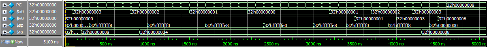

# 数字逻辑与处理器基础大作业

无 36

李思涵

2013011187

## 处理器结构

处理器结构图与教材的区别：


### 回答问题

a) 31 代表第 31 号寄存器 $ra。在执行 jal/jalr 时需要使用，因为运行这两条指令时，需要将下一条指令的地址（PC + 4）保存在 $ra 中。

b) 是 shamt，即为移位量（shift amount）。在 sll/srl/sra 指令中会用到，因为这些指令需要指定位移量。

c) 对应的是下一条指令的地址（PC + 4）。在执行 jal/jalr 时需要 MemtoReg 为 2，因为这两条指令需要将 PC + 4 写入寄存器 $ra。

d) 对应的是 Read data 1 所读出的寄存器值。执行 jr/jalr 时需要 PCSrc 为 2，因为这两条指令需要跳转到寄存器所指示的地址。

e) 因为要实现有符号算数和无符号算数，前者需要符号扩展，后者需要无符号扩展。执行 lw/sw/addi/addiu/andi/slti/beq 时需要 ExtOp 为 1，sltiu 时需要 ExtOp 为 0。

其中要注意的是 addiu 需要符号扩展，其与 addi 的区别只在于前者不会溢出。

f) 不需要修改。因为 nop 指令相当于 sll $zero, $zero, 0，而由于向 $zero 的写操作会被忽略，所以这条指令没有任何副作用，所以可以相当于空指令。（事实上，如果目的寄存器为 $zero 的话，基本上每条指令都会变成空指令）


### 填写真值表

|       | PC<br>Sr<br>c[1:<br>0] | Br<br>an<br>ch | Re<br>gW<br>ri<br>te | Re<br>gD<br>st<br>[1:<br>0] | Me<br>mR<br>ea<br>d | Me<br>mW<br>ri<br>te | Me<br>mt<br>oR<br>eg<br>[1:<br>0] | AL<br>US<br>rc<br>1 | AL<br>US<br>rc<br>2 | Ex<br>to<br>p | Lu<br>op |
|-------|------------|--------|----------|-------------|---------|----------|---------------|---------|---------|-------|------|
| lw    |          0 | 0      |        1 | 0           |       1 |        0 | 1             | 0       | 1       | 1     | 0    |
| sw    |          0 | 0      |        0 | x           |       0 |        1 | x             | 0       | 1       | 1     | 0    |
| lui   |          0 | 0      |        1 | 0           |       0 |        0 | 0             | 0       | 1       | x     | 1    |
| add   |          0 | 0      |        1 | 1           |       0 |        0 | 0             | 0       | 0       | x     | x    |
| addu  |          0 | 0      |        1 | 1           |       0 |        0 | 0             | 0       | 0       | x     | x    |
| sub   |          0 | 0      |        1 | 1           |       0 |        0 | 0             | 0       | 0       | x     | x    |
| subu  |          0 | 0      |        1 | 1           |       0 |        0 | 0             | 0       | 0       | x     | x    |
| addi  |          0 | 0      |        1 | 0           |       0 |        0 | 0             | 0       | 1       | 1     | 0    |
| addiu |          0 | 0      |        1 | 0           |       0 |        0 | 0             | 0       | 1       | 1     | 0    |
| and   |          0 | 0      |        1 | 1           |       0 |        0 | 0             | 0       | 0       | x     | x    |
| or    |          0 | 0      |        1 | 1           |       0 |        0 | 0             | 0       | 0       | x     | x    |
| xor   |          0 | 0      |        1 | 1           |       0 |        0 | 0             | 0       | 0       | x     | x    |
| nor   |          0 | 0      |        1 | 1           |       0 |        0 | 0             | 0       | 0       | x     | x    |
| andi  |          0 | 0      |        1 | 0           |       0 |        0 | 0             | 0       | 1       | 1     | 0    |
| sll   |          0 | 0      |        1 | 1           |       0 |        0 | 0             | 1       | 0       | x     | x    |
| srl   |          0 | 0      |        1 | 1           |       0 |        0 | 0             | 1       | 0       | x     | x    |
| sra   |          0 | 0      |        1 | 1           |       0 |        0 | 0             | 1       | 0       | x     | x    |
| slt   |          0 | 0      |        1 | 1           |       0 |        0 | 0             | 0       | 0       | x     | x    |
| sltu  |          0 | 0      |        1 | 1           |       0 |        0 | 0             | 0       | 0       | x     | x    |
| slti  |          0 | 0      |        1 | 0           |       0 |        0 | 0             | 0       | 1       | 1     | 0    |
| sltiu |          0 | 0      |        1 | 0           |       0 |        0 | 0             | 0       | 1       | 0     | 0    |
| beq   |          0 | 1      |        0 | x           |       0 |        0 | x             | 0       | 0       | 1     | 0    |
| j     |          1 | x      |        0 | x           |       0 |        0 | x             | x       | x       | x     | x    |
| jal   |          1 | x      |        1 | 2           |       0 |        0 | 2             | x       | x       | x     | x    |
| jr    |          2 | x      |        0 | x           |       0 |        0 | x             | x       | x       | x     | x    |
| jalr  |          2 | x      |        1 | 2           |       0 |        0 | 2             | x       | x       | x     | x    |


## 完成控制器

### 阅读程序
执行足够长时间后，程序会一直运行第 11 行，即不停无条件跳转到本条语句而死循环。

程序的执行过程如下：

     0: $a0 <= 0x00003039  (0x0 + 0x00003039)
     1: $a1 <= 0xffffd431  (0x0 + 0xffffd431, 立即数符号扩展)
     2: $a2 <= 0xd4310000  (0xffffd431 << 16)
     3: $a3 <= 0xffffd431  (0xd4310000 >> 16, 算术右移)
     4:                    ($a3 == $a1, 跳转至 L1)
     6: $t0 <= 0xd4313039  (0xd4310000 + 0x00003039)
     7: $t1 <= 0xffd43130  (0xd4313039 >> 8)
     8: $t2 <= 0xffffcfc7 (0x0 + 0xffffcfc7, 立即数符号扩展)
     9: $v0 <= 0x00000000  (0x00003039 ≮ 0xffffcfc7, 有符号数比较)
    10: $v1 <= 0x00000001  (0x00003039 < 0xffffcfc7, 无符号数比较)
    11:                    (进入死循环)

各个寄存器的终值如上所示。

如果某一时刻一寄存器中放着 0xffffcfc7，不能判断其是有符号数还是无符号数。

因为有符号数和无符号数在存储时没有区别，只是在进行具体操作是可以将其看做有符号/无符号数。

例如上面程序中 9 - 10 行中的 slt 和 sltu，都是对 $t2 进行操作，不过 slt 将 $t2 看做有符号数， sltu 将 $t2 看做无符号数。


### 观察仿真结果


a) PC 从 0x00000000 变化到了 0x0000002c，最后维持不变（进入死循环）。

b) Branch 信号在 400~500ns 时为 1。它使 PC 从 0x00000010 跳转到了 0x00000018，即增加了 8。

c) 100~200ns 期间 PC 为 0x00000004，对应着 `addiu $a1, $zero, -11215`。

此时 $a1 的值是 0x00000000，200~300ns $a1 的值是 0xffffd431。因为在 200ns 时钟上升沿到来时，前一时钟周期计算出的 $a0 的新值才被写入寄存器文件。

下条指令立即使用 $a1 不会出现错误，因为在下个时钟周期开始时 $a1 的新值已经写入了，故当电路稳定后，读到的 $a1 的值一定是新值。

d) 运行足够长时间后，各寄存器的值为：

* $a0: 0x00003039
* $a1: 0xffffd431
* $a2: 0xd4310000
* $a3: 0xffffd431
* $t0: 0xd4313039
* $t1: 0xffd43130
* $t2: 0xffffcfc7
* $v0: 0x00000000
* $v1: 0x00000001

和预期一致。


## 执行汇编程序

### 程序功能

这段程序的功能是计算 1 + 2 + ... + n。

* `Loop` 使程序死循环，停在这一条语句。
* `sum` 是 sum 函数的入口。
* `L1` 所在的分支递归调用了 sum 函数，从而递归实现了求和的功能。

程序及注释如下：

```
      addi $a0, $zero, 3      # $a0 = n
      jal sum                 # Call sum(n)
Loop:
      beq $zero, $zero, Loop  # Stuck in here
sum:                          # Calculate sum(i)
      addi $sp, $sp, -8       # Allocate space on stack
      sw $ra, 4($sp)          # Save return address
      sw $a0, 0($sp)          # Save argument i
      slti $t0, $a0, 1        # Set $t0 to 1 if i < 1
      beq $t0, $zero, L1      # Go to L1 if i >= 1
      xor $v0, $zero, $zero   # Set return value to 0
      addi $sp, $sp, 8        # Free stack space
      jr $ra                  # Return 0 if i < 1
L1:
      addi $a0, $a0, -1       # $a0 = i - 1
      jal sum                 # Call sum(i - 1)
      lw $a0, 0($sp)          # Restore argument i
      lw $ra, 4($sp)          # Restore return address
      addi $sp, $sp, 8        # Free stack space
      add $v0, $a0, $v0       # Add i to return value of sum(i - 1)
      jr $ra                  # return i + sum(i - 1)
```


### 翻译为机器码

```
0000000: 001000  00000  00100  00000  00000  000011
0000004: 000011  00000  00000  00000  00000  000011
0000008: 000100  00000  00000  11111  11111  111111
000000c: 001000  11101  11101  11111  11111  111000
0000010: 101011  11101  11111  00000  00000  000100
0000014: 101011  11101  00100  00000  00000  000000
0000018: 001010  00100  01000  00000  00000  000001
000001c: 000100  01000  00000  00000  00000  000011
0000020: 000000  00000  00000  00010  00000  100110
0000024: 001000  11101  11101  00000  00000  001000
0000028: 000000  11111  00000  00000  00000  001000
000002c: 001000  00100  00100  11111  11111  111111
0000030: 000011  00000  00000  00000  00000  000011
0000034: 100011  11101  00100  00000  00000  000000
0000038: 100011  11101  11111  00000  00000  000100
000003c: 001000  11101  11101  00000  00000  001000
0000040: 000000  00100  00010  00010  00000  100000
0000044: 000000  11111  00000  00000  00000  001000
```

其中左方为指令地址。

beq 中的 Loop, L1 翻译成了相对地址，即标签所指指令相对 beq 下一条指令的偏移量 / 4。例如，beq $zero, $zero, Loop 中的 Loop 便翻译成了 -1。

jal 中的 sum 则翻译成了指令的绝对地址 / 4，即为 sum 代表的指令在内存中的位置 / 4 = 3。

立即数 -1 翻译成了 0xFFFF，-8 翻译成了 0xFFF8。都是使用 2-补码 表示的。


### 运行仿真

a) 运行时间足够长之后，$a0 和 $v0 的值：

预期结果：

* $a0 = 最外层 sum 函数调用的参数 = 3
* $v0 = sum(3) = 1 + 2 + 3 = 6

实际结果：

* $a0 = 0x00000003
* $v0 = 0x00000006



仿真结果与预期相符。

b) 各个寄存器的变化如下：

* PC: 每个时钟周期改变一次，最后保持在 0x00000008

    其中，最后的 0x00000008 即为 Loop 所对应的那一条指令，即最后在这一句指令死循环。

* $a0: 3 => 2 => 1 => 0 => 1 => 2 => 3

    在进行递归函数调用之前，$a0 会被设成将要进行的调用的参数。故其值先从 3 一直减小到了 0。然后递归调用开始逐级返回，每返回一级那一层的参数又会被重新读取出来，故又从 0 一直增大到了 3。

* $v0: 0 => 1 => 3 => 6

    在递归函数调用从里到外依次返回时，$v0 里依次装着 sum(0), sum(1), sum(2) 和 sum(3)。其中 sum(0) = 0, sum(1) = 1, sum(2) = 3, sum(3) = 6。故 $v0 一共变化了三次。

* $sp: 0x00000000 => 0xfffffff8 => 0xfffffff0 => 0xffffffe8 => 0xffffffe0 => 0xffffffe8 => 0xfffffff0 => 0xfffffff8 => 0x00000000

    由于一共发生了 4 次嵌套函数调用，故在栈上一共分配了 4 次空间，也释放了 4 次空间。所以栈指针先减小了 4 次，又增加了四次。

* $ra: 0x00000000 => 0x00000008 => 0x00000034 => 0x00000008

    与 $sp 类似，不过变化次数较少。这是由于虽然一共有 4 次 sum 函数调用，但由于后三次为递归调用，进入函数时指令地址都相同，故 $ra 没有发生变化。
