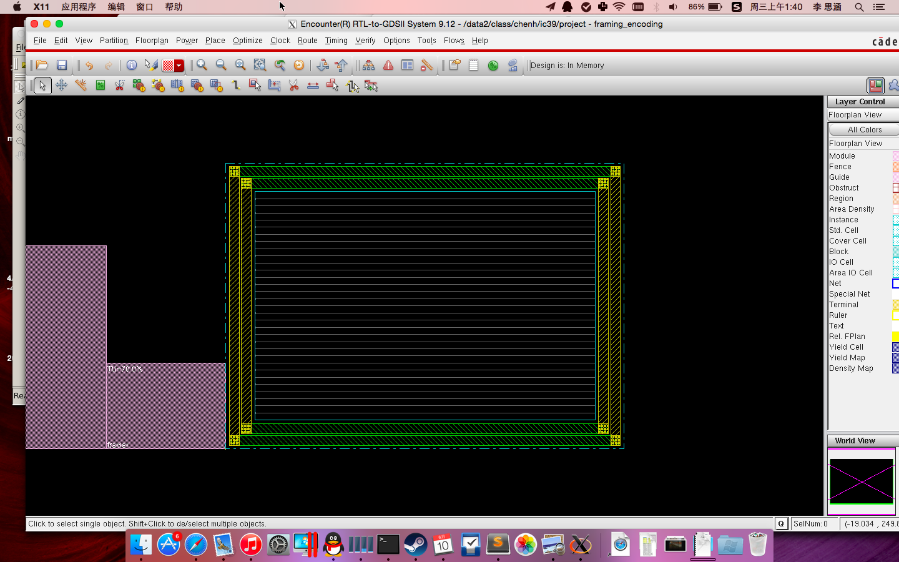
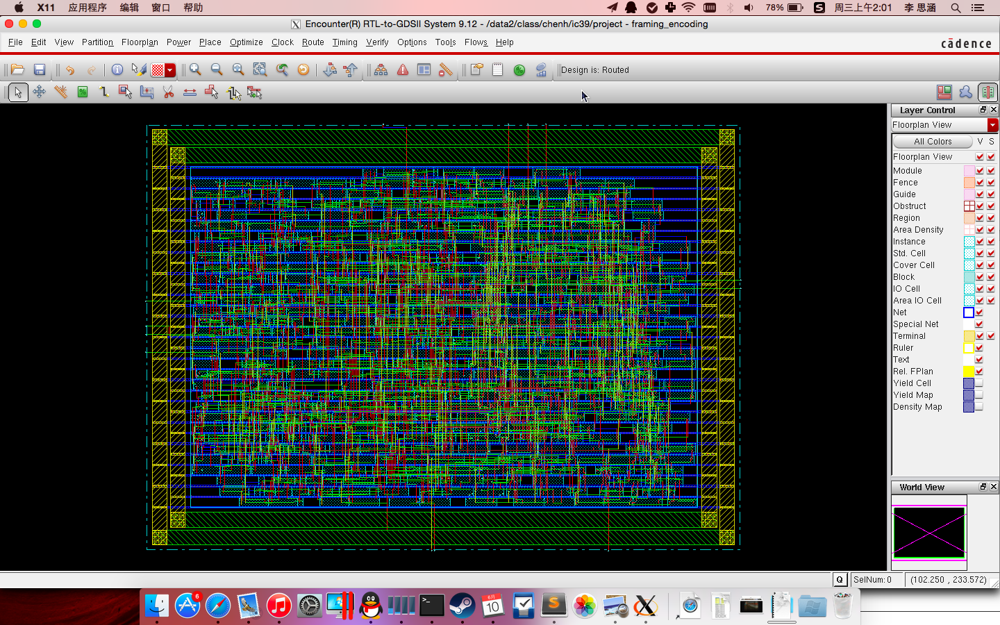

# 物理层组帧编码

## 模块实现
### 帧结构


### 顶层模块


```verilog
module framing_encoding(
    output framing_encoding_out,
    output framing_encoding_out_valid,
    input [7:0] phr_psdu_in,
    input phr_psdu_in_valid,
    input clk,
    input reset_n
);
```

### FIFO

由于输入速度和输出速度可能不匹配，并且在输出前导码和帧分隔符时输入数据会继续到来，故需要一
FIFO 将输入的数据进行暂存。

同时注意到，framing_crc 模块需要一个信号来指示开始组帧，故 fifo 模块还需要输出一个
indicator 控制信号。

具体的接口设计如下：

```verilog
module fifo(
    output [7:0] dout,
    output indicator,  // Indicates a state change.
    input [7:0] din,
    input din_valid,
    input clk,
    input reset_n
);
```


同时，为了给 framing_crc 模块留下组帧的空间，我们在出栈时为那些数据留出了位置。FIFO 共有
如下 5 个状态：

- `WAITING`
- `RECEIVING`
- `LEFT_PADDING`
- `TRANSFERING`
- `RIGHT_PADDING`


### Framing & CRC

```verilog
module framing_crc(
    output reg [7:0] dout,
    output next_indicator,
    input [7:0] din,
    input indicator,
    input clk,
    input reset_n
);
```


### Data Whiting

```verilog
module data_whiting(
    output [7:0] dout,
    output next_indicator,
    input [7:0] din,
    input indicator,
    input clk,
    input reset_n
);
```


### Serializing

```verilog
module serializing(
    output reg dout,
    output reg dout_valid,
    input [7:0] din,
    input indicator,
    input clk,
    input reset_n
);
```


## NC 仿真


## DC 综合


### Area Report

```
****************************************
Report : area
Design : framing_encoding
Version: D-2010.03
Date   : Tue Jun  9 22:40:45 2015
****************************************

Information: Updating design information... (UID-85)
Library(s) Used:

    typical (File: /software/course_lib_umc18/tt_1v8_25c.db)

Number of ports:               13
Number of nets:                40
Number of cells:                4
Number of references:           4

Combinational area:       10677.744225
Noncombinational area:    16465.680237
Net Interconnect area:    118627.274841

Total cell area:          27143.424461
Total area:               145770.699303
```

### Timing Report
```
****************************************
Report : timing
        -path full
        -delay max
        -max_paths 1
        -sort_by group
Design : framing_encoding
Version: D-2010.03
Date   : Tue Jun  9 22:40:58 2015
****************************************

Operating Conditions: typical   Library: typical
Wire Load Model Mode: top

  Startpoint: queue/head_reg[5]
              (rising edge-triggered flip-flop clocked by clk)
  Endpoint: framer/crc_reg[3]
            (rising edge-triggered flip-flop clocked by clk)
  Path Group: clk
  Path Type: max

  Des/Clust/Port     Wire Load Model       Library
  ------------------------------------------------
  framing_encoding   umc18_wl10            typical

  Point                                    Incr       Path
  -----------------------------------------------------------
  clock clk (rise edge)                    0.00       0.00
  clock network delay (ideal)              0.00       0.00
  queue/head_reg[5]/CK (DFFRHQX1)          0.00       0.00 r
  queue/head_reg[5]/Q (DFFRHQX1)           0.20       0.20 f
  queue/U374/Y (BUFX2)                     0.38       0.58 f
  queue/U384/Y (NOR2X1)                    0.97       1.55 r
  queue/U191/Y (NAND2X1)                   1.06       2.62 f
  queue/U57/Y (OAI21X1)                    1.06       3.68 r
  queue/U218/Y (OAI32X1)                   0.29       3.96 f
  queue/dout[3] (fifo)                     0.00       3.96 f
  framer/din[3] (framing_crc)              0.00       3.96 f
  framer/U42/Y (AOI222XL)                  0.47       4.43 r
  framer/U71/Y (NOR2X1)                    0.12       4.55 f
  framer/U70/Y (OAI32X1)                   0.30       4.85 r
  framer/U69/Y (XOR2X1)                    0.42       5.27 r
  framer/U25/Y (OR2X1)                     0.29       5.56 r
  framer/U44/Y (OAI221X1)                  0.14       5.71 f
  framer/crc_reg[3]/D (DFFSHQX1)           0.00       5.71 f
  data arrival time                                   5.71

  clock clk (rise edge)                100000.00  100000.00
  clock network delay (ideal)              0.00   100000.00
  framer/crc_reg[3]/CK (DFFSHQX1)          0.00   100000.00 r
  library setup time                      -0.29   99999.71
  data required time                              99999.71
  -----------------------------------------------------------
  data required time                              99999.71
  data arrival time                                  -5.71
  -----------------------------------------------------------
  slack (MET)                                     99994.00
```


## 门级仿真


## 布局布线

### Add Power Rings


### Placement


### Special Route


### Create Clock Tree


### Trail Routing


### Nano Routing


### Add Filling


### Post–Route Optimization


### Verify Geometry


### Area Route


## 源代码

### framing_encoding.v

```verilog
`timescale 1us/100ns

module framing_encoding(
    output framing_encoding_out,
    output framing_encoding_out_valid,
    input [7:0] phr_psdu_in,
    input phr_psdu_in_valid,
    input clk,
    input reset_n
);

wire [7:0] fifo_out;
wire fifo_indicator;

fifo queue(fifo_out,
           fifo_indicator,
           phr_psdu_in,
           phr_psdu_in_valid,
           clk,
           reset_n);

wire [7:0] framing_crc_out;
wire framing_crc_indicator;

framing_crc framer(framing_crc_out, framing_crc_indicator,
                   fifo_out, fifo_indicator, clk, reset_n);

wire [7:0] whiting_out;
wire whiting_out_indicator;

data_whiting whiter(whiting_out, whiting_out_indicator,
                    framing_crc_out, framing_crc_indicator, clk, reset_n);

serializing serializer(framing_encoding_out, framing_encoding_out_valid,
                       whiting_out, whiting_out_indicator, clk, reset_n);

endmodule
```


### fifo.v

```verilog
`timescale 1us/100ns

module fifo(
    output [7:0] dout,
    output indicator,  // Indicates a state change.
    input [7:0] din,
    input din_valid,
    input clk,
    input reset_n
);

parameter SIZE = 20,
          INDEX_WIDTH = 8,
          MAX_INDEX = SIZE * 8 - 1;

localparam WAITING = 0,
           RECEIVING = 1,
           LEFT_PADDING = 2,
           TRANSFERING = 3,
           RIGHT_PADDING = 4;

reg [2:0] state, next_state;
reg [MAX_INDEX:0] queue, next_queue;
reg [INDEX_WIDTH - 1:0] head, next_head;  // The head of the queue.
reg [6:0] count, next_count;

always @(*) begin
    case (state)
        WAITING: begin
            if (din_valid) begin
                next_state = RECEIVING;
                next_queue = {queue[MAX_INDEX - 8:0],
                              din};
                next_head = 8;
            end else begin
                next_state = WAITING;
                next_queue = queue;
                next_head = 0;
            end
            next_count = 0;
        end

        RECEIVING: begin
            if (din_valid) begin
                next_state = RECEIVING;
                next_queue = {queue[MAX_INDEX - 8:0],
                              din};
                next_head = head + 8;
            end else begin
                next_state = LEFT_PADDING;
                next_queue = queue;
                next_head = head;
            end
            next_count = 0;
        end

        LEFT_PADDING: begin
            if (count < 79) begin
                next_state = LEFT_PADDING;
                next_count = count + 1;
            end else begin
                next_state = TRANSFERING;
                next_count = 0;
            end
            next_head = head;
            next_queue = queue;
        end

        TRANSFERING: begin
            if (count < 7) begin
                next_state = TRANSFERING;
                next_head = head;
                next_count = count + 1;
            end else begin
                if (head == 8)  // Last byte.
                    next_state = RIGHT_PADDING;
                else
                    next_state = TRANSFERING;
                next_head = head - 8;
                next_count = 0;
            end
            next_queue = queue;
        end

        RIGHT_PADDING: begin
            if (count < 15) begin
                next_state = RIGHT_PADDING;
                next_count = count + 1;
            end else begin
                next_state = WAITING;
                next_count = 0;
            end
            next_head = 0;
            next_queue = 0;
        end

        default: begin
            next_state = WAITING;
            next_queue = 0;
            next_head = 0;
            next_count = 0;
        end
    endcase
end

// Update states.
always @(posedge clk or negedge reset_n) begin
    if (~reset_n) begin
        state <= WAITING;
        queue <= 0;
        head <= 0;
        count <= 0;
    end else begin
        state <= next_state;
        queue <= next_queue;
        head <= next_head;
        count <= next_count;
    end
end

assign dout = (head == 0) ? 0 : queue[(head - 1)-:8],
       indicator = (state == RECEIVING && ~din_valid) ||
                   (state == TRANSFERING && next_state == RIGHT_PADDING);

endmodule
```


### framing_crc.v

```verilog
`timescale 1us/100ns

module framing_crc(
    output reg [7:0] dout,
    output next_indicator,
    input [7:0] din,
    input indicator,
    input clk,
    input reset_n
);

localparam CRC_INIT = 16'hffff;

localparam WAITING = 0,
           SHR = 1,
           PHR_PSDU = 2,
           FCS = 3;

reg [1:0] state, next_state;
reg [6:0] count, next_count;

reg [15:0] crc, next_crc;
wire crc_in = din[(count[2:0])-:1] ^ crc[0];

always @(*) begin
    case (state)
        WAITING: begin
            if (indicator)
                next_state = SHR;
            else
                next_state = WAITING;
            next_count = 0;
            next_crc = CRC_INIT;
        end

        SHR: begin
            if (count < 79) begin
                next_state = SHR;
                next_count = count + 1;
            end else begin
                next_state = PHR_PSDU;
                next_count = 0;
            end
            next_crc = CRC_INIT;
        end

        PHR_PSDU: begin
            next_state = (indicator ? FCS : PHR_PSDU);
            next_count = (count == 7 ? 0 : count + 1);
            next_crc = {crc_in,
                        crc[15:12],
                        crc[11] ^ crc_in,
                        crc[10:5],
                        crc[4] ^ crc_in,
                        crc[3:1]};
        end

        FCS: begin
            if (count < 15) begin
                next_state = FCS;
                next_count = count + 1;
                next_crc = crc;
            end else begin
                next_state = WAITING;
                next_count = 0;
                next_crc = CRC_INIT;
            end
        end

        default: begin
            next_state = WAITING;
            next_count = 0;
            next_crc = CRC_INIT;
        end
    endcase
end

// Update states.
always @(posedge clk or negedge reset_n) begin
    if (~reset_n) begin
        state <= WAITING;
        count <= 0;
        crc <= CRC_INIT;
    end else begin
        state <= next_state;
        count <= next_count;
        crc <= next_crc;
    end
end

always @(*) begin
    case (state)
        SHR:
            if (count < 64)
                dout = 8'haa;
            else if (count < 72)
                dout = 8'h98;
            else
                dout = 8'hf3;
        
        PHR_PSDU:
            dout = din;

        FCS:
            dout = ~(count < 8 ? crc[7:0] : crc[15:8]);

        default:
            dout = 0;
    endcase
end

assign next_indicator = (state == WAITING && indicator ||
                         state == FCS && count == 15);

endmodule
```


### data_whiting.v

```verilog
`timescale 1us/100ns

module data_whiting(
    output [7:0] dout,
    output next_indicator,
    input [7:0] din,
    input indicator,
    input clk,
    input reset_n
);

localparam RANDOM_INIT = 9'b1_1111_1111;

localparam WAITING = 0,
           PADDING = 1,
           ENCODING = 2;

reg [1:0] state, next_state;
reg [6:0] count, next_count;

reg [8:0] random_regs, next_random_regs;
reg [7:0] working_random, next_working_random;
wire [8:0] next_random = {random_regs[5] ^ random_regs[0], random_regs[8:1]};

always @(*) begin
    case (state)
        WAITING: begin
            if (indicator)
                next_state = PADDING;
            else
                next_state = WAITING;
            next_count = 0;
            next_random_regs = RANDOM_INIT;
            next_working_random = RANDOM_INIT;
        end

        PADDING: begin
            if (count < 79) begin
                next_state = PADDING;
                next_count = count + 1;
                next_random_regs = RANDOM_INIT;
            end else begin
                next_state = ENCODING;
                next_count = 0;
                next_random_regs = next_random;
            end
            next_working_random = RANDOM_INIT;
        end

        ENCODING: begin
            if (indicator) begin
                next_state = WAITING;
                next_count = 0;
            end else begin
                next_state = ENCODING;
                next_count = count + 1;
            end
            next_random_regs = next_random;
            next_working_random = (count[2:0] == 7 ?
                                   random_regs :
                                   working_random);
        end

        default: begin
            next_state = WAITING;
            next_count = 0;
            next_random_regs = RANDOM_INIT;
            next_working_random = RANDOM_INIT;
        end
    endcase
end

// Update states.
always @(posedge clk or negedge reset_n) begin
    if (~reset_n) begin
        state <= WAITING;
        count <= 0;
        random_regs <= RANDOM_INIT;
        working_random <= RANDOM_INIT;
    end else begin
        state <= next_state;
        count <= next_count;
        random_regs <= next_random_regs;
        working_random <= next_working_random;
    end
end

assign next_indicator = indicator;

assign dout = (state == ENCODING ? din ^ working_random : din);

endmodule
```


### serializing.v

```verilog
`timescale 1us/100ns

module serializing(
    output reg dout,
    output reg dout_valid,
    input [7:0] din,
    input indicator,
    input clk,
    input reset_n
);

localparam WAITING = 0,
           SENDING = 1;

reg state;
wire next_state;

reg [2:0] count;
wire [2:0] next_count;

// Here we update only on posedge clk to avoid hazard.
wire dout_next = din[count-:1],
     dout_valid_next = (state == SENDING);

assign next_state = (indicator ? ~state : state),
       next_count = (state == WAITING ? 0 : count + 1);

// Update states.
always @(posedge clk or negedge reset_n) begin
    if (~reset_n) begin
        state <= WAITING;
        count <= 0;
        dout <= 0;
        dout_valid <= 0;
    end else begin
        state <= next_state;
        count <= next_count;
        dout <= dout_next;
        dout_valid <= dout_valid_next;
    end
end

endmodule
```


### framing_encoding_test.v

```verilog
`timescale 1us/100ns

module framing_encoding_test;

     wire             framing_encoding_out;
     wire             framing_encoding_out_valid;
     reg     [7:0]    phr_psdu_in;
     reg              phr_psdu_in_valid;
     reg              clk;
     reg              reset_n;
 
 
initial begin
  $monitor(
    $time,
    " indicator: %b, framing_out: %h, whiting_out: %h, serializing_out: %h",
    framing_encoding_out_valid,
    u0framing_encoding.framing_crc_out,
    u0framing_encoding.whiting_out,
    framing_encoding_out);
end

 framing_encoding u0framing_encoding(
   .framing_encoding_out        (framing_encoding_out),
   .framing_encoding_out_valid  (framing_encoding_out_valid),
   .phr_psdu_in                 (phr_psdu_in),
   .phr_psdu_in_valid           (phr_psdu_in_valid),
   .clk                         (clk),
   .reset_n                     (reset_n)
   );

// stop simulation after 20000us
  initial 
    begin
    #20000 $finish;
    end


    
// generate data input signal
  initial 
    begin
             phr_psdu_in=8'h00;
        #500 phr_psdu_in=8'h07;
        #100 phr_psdu_in=8'h03;
        #100 phr_psdu_in=8'h01;
        #100 phr_psdu_in=8'h05;
        #100 phr_psdu_in=8'h21;
        #100 phr_psdu_in=8'h43;
        #100 phr_psdu_in=8'h65;
        #100 phr_psdu_in=8'h87;
    end

// generate phr_psdu_in_valid signal
  initial 
    begin
             phr_psdu_in_valid =1'b0;
        #500 phr_psdu_in_valid =1'b1;
        #800 phr_psdu_in_valid =1'b0;
    end
    
// generate clk signal
  initial 
    begin
        clk=1'b0;
    end
always #50 clk=~clk;

// generate resrt_n signal
  initial 
    begin
               reset_n=1'b1;
        #  520 reset_n=1'b0;
        #  20  reset_n=1'b1;
    end

endmodule
```
